<div align="center">


# MindBrick

**Program your old LEGO® Mindstorms® NXT from a browser – snap blocks together, press *Run on robot*, done.**

No installation. No new firmware. Works on a laptop or an Android tablet, over USB or Bluetooth.

[](https://ivannakramer.github.io/MindBrick/)
[](https://ivannakramer.github.io/MindBrick/?demo)


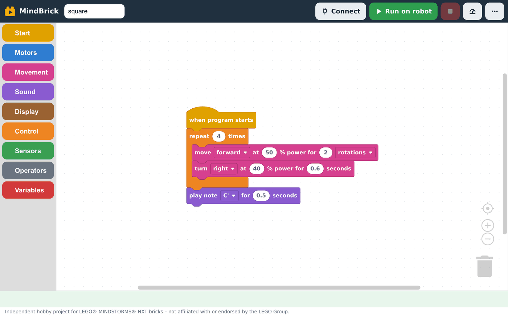

</div>

> **Status: early prototype.** Everything in this guide works today, but expect rough edges. The robot runs its program on its own after you upload it – the browser is only needed to build and send it.

---

## 📚 Contents

1. [What you need](#-what-you-need)
2. [Quick start – five steps](#-quick-start--five-steps)
3. [A tour of the screen](#-a-tour-of-the-screen)
4. [Connecting the robot](#-connecting-the-robot)
5. [Building a program](#-building-a-program)
6. [Running and stopping](#-running-and-stopping)
7. [The Robot panel: live sensors and files on the brick](#-the-robot-panel-live-sensors-and-files-on-the-brick)
8. [The ⋯ menu: code, files, examples, language](#-the--menu-code-files-examples-language)
9. [Using it on a tablet and offline](#-using-it-on-a-tablet-and-offline)
10. [Troubleshooting](#-troubleshooting)
11. [For developers](#-for-developers)
12. [Disclaimer and license](#-disclaimer-and-license)

---

## 🧰 What you need

| | Requirement | Notes |
|---|---|---|
| 🧱 **Brick** | LEGO Mindstorms NXT (1.0 or 2.0) with the **stock LEGO firmware** (tested with 1.31) | Nothing is flashed. Your brick stays exactly as it is. |
| 💻 **Device** | Laptop / PC (Windows, macOS, Linux) **or** an Android tablet / phone | iPads and iPhones do not work – Safari cannot talk to USB or Bluetooth devices. |
| 🌐 **Browser** | **Chrome** or **Edge** on desktop. On Android: **Chrome 137 or newer** | Firefox and Safari are not supported. |
| 🔌 **Connection** | A USB cable (the NXT uses the square "USB-B" plug) **or** the brick's built-in Bluetooth | Bluetooth needs no cable and no driver, so it is the easiest choice on a tablet. |
| 🔋 **Batteries** | Six AA cells or the rechargeable pack, reasonably fresh | Below about 6.5 V the brick becomes unreliable. The battery symbol in the toolbar shows the level. |

No hardware yet? Open **[the demo](https://ivannakramer.github.io/MindBrick/?demo)** and pick *Demo robot* – a pretend NXT that lets you try every button.

---

## 🚀 Quick start – five steps

| Step | What to do |
|:---:|---|
| **1** | **Switch on the NXT.** For **Bluetooth**, pair it once in your device's Bluetooth settings (the passkey is `1234`). For **USB**, plug in the cable. |
| **2** | **Open [ivannakramer.github.io/MindBrick](https://ivannakramer.github.io/MindBrick/)** in Chrome or Edge. |
| **3** | **Press `Connect`**, choose *Bluetooth* or *USB cable*, then pick your brick in the browser's chooser window. |
| **4** | **Build a program** by dragging blocks under the yellow *when program starts* block. |
| **5** | **Press `▶ Run on robot`.** The program is compiled in the browser, sent to the brick and started. |

That's it – the robot now runs on its own. The program also stays on the brick, so you can start it again later from the brick's own menu (*My Files → Software files*).

> 🐧 **Linux + USB:** run `bash tools/install_udev.sh` once so the browser is allowed to open the brick.
> 🪟 **Windows + USB:** install the WinUSB driver for the NXT once with [Zadig](https://zadig.akeo.ie/). Bluetooth needs no driver.

---

## 🗺️ A tour of the screen

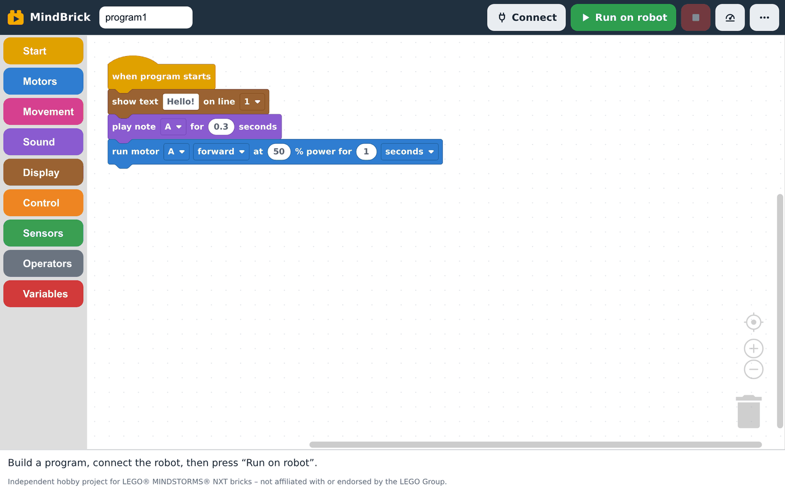

When you open MindBrick you see a small starter program: show *Hello!* on the screen, beep, and run motor A for a second.

| Where | What it does |
|---|---|
| **Program name** (top left) | The file name on the brick. Up to 15 letters, digits, `-` and `_`. |
| **Coloured column** (left) | The **toolbox**. Click a colour to open a drawer of blocks, then drag a block onto the white workspace. |
| **White area** | The **workspace**. Blocks snap together under the *when program starts* hat. Drag blocks to the bin at the bottom right to delete them. |
| `🔌 Connect` | Opens the connection menu. Turns green and shows the robot's name and battery level once connected. |
| `▶ Run on robot` | Compiles the blocks, sends the program to the brick and starts it. |
| `■` (red) | Stops whatever program is running on the brick. |
| `⏲` (gauge) | Opens the **Robot panel**: live sensor and motor values, the programs stored on the brick. |
| `⋯` | More: show code, save / open files, examples, language. |
| **Status line** (bottom) | Tells you what is happening – connecting, building, sending, running – and explains problems in plain words. |

**Workspace controls** at the bottom right: ⊕ / ⊖ zoom, ◎ centres the blocks. You can also scroll and pinch on a touch screen. Right-click (or long-press) the workspace for *Clean up blocks*, *Collapse* and *Delete*.

---

## 🔌 Connecting the robot

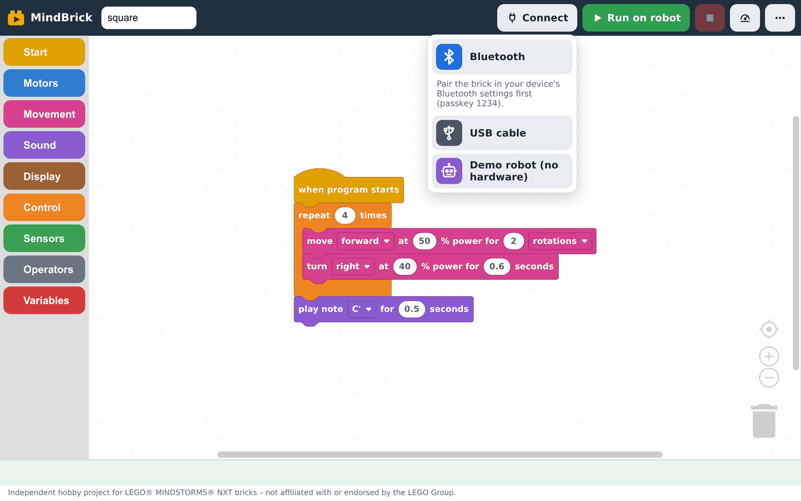

Press `Connect` and choose how to reach the brick:

| Option | When to use it |
|---|---|
| 🟦 **Bluetooth** | Wireless. Pair the brick in your device's Bluetooth settings first (passkey `1234`, the brick shows a key symbol when Bluetooth is on). Then pick the brick in the browser's list. Works on laptops and on Android (Chrome 137+). |
| ⬛ **USB cable** | Fastest and most reliable. Pick the brick in the browser's list. On Linux and Windows see the driver notes in [Quick start](#-quick-start--five-steps). |
| 🟪 **Demo robot** | Only shown when the address ends in `?demo`. A pretend NXT in the browser – no hardware needed. |
| **Bluetooth / USB – last robot** | Appears once you have connected before. Skips the chooser window and reconnects to the same brick with one tap. |

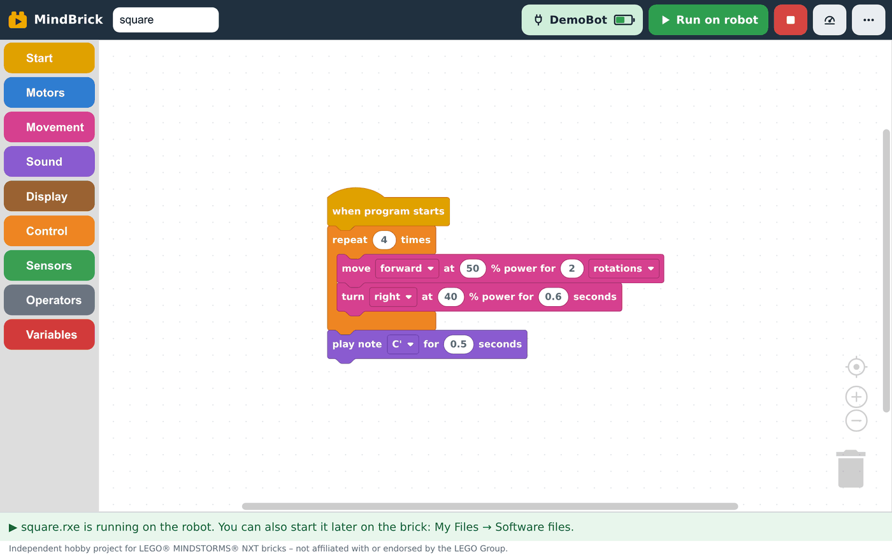

Once connected, the button shows the **robot's name and a battery symbol**. The red `■` button becomes active. `Connect → Disconnect` lets go of the brick, which is useful when another program or tab wants it.

> ℹ️ Only **one** tab or program can talk to the brick at a time. MindBrick releases the brick automatically when you close the tab.

---

## 🧩 Building a program

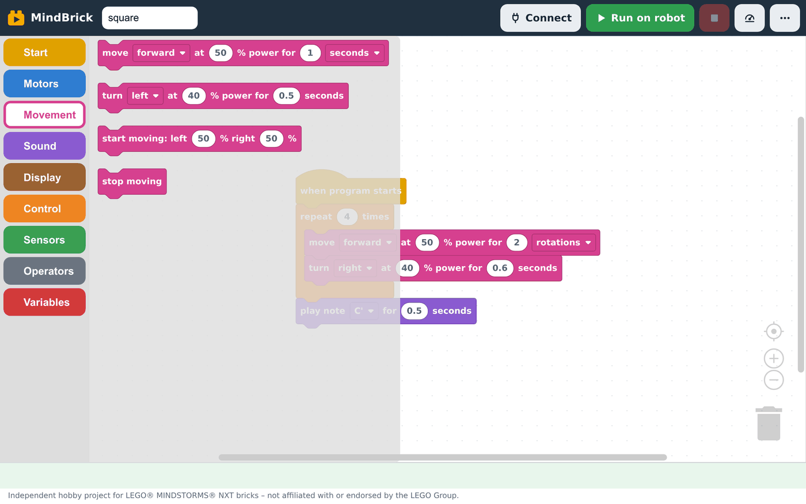

Click a colour in the toolbox, drag a block into the workspace and drop it under the block above – it snaps into place. Every number field can be edited by clicking on it; dropdowns (▾) offer ports, directions and units.

Every program starts with the yellow **when program starts** hat. Blocks that are not attached to it are ignored, and the status line tells you so.

### The blocks

| Colour | Category | Blocks |
|---|---|---|
| 🟨 | **Start** | *when program starts* |
| 🟦 | **Motors** | run motor A/B/C for … seconds / rotations / degrees · start motor · stop motor |
| 🟪 | **Movement** (both drive motors B + C) | move forward / backward for … · turn left / right for … seconds · start moving with left / right power · stop moving |
| 🟣 | **Sound** | play note … for … seconds · play tone … Hz for … seconds |
| 🟫 | **Display** | show text on line … · show number on line … · clear screen |
| 🟧 | **Control** | wait … seconds · repeat … times · forever · if · if / else · wait until · repeat until · stop program |
| 🟩 | **Sensors** | touch sensor pressed? · light sensor % · ultrasonic distance cm · sound sensor % · brick button pressed? · motor rotation ° · reset rotation · timer · reset timer |
| ⬜ | **Operators** | + − × ÷ · comparisons (= ≠ < > ≤ ≥) · and / or · not · true / false · random number |
| 🟥 | **Variables** | make a variable, set it, change it, read it |

Sensor blocks have a **port** dropdown (1 – 4). If you use the same port for two different sensor types, the block is marked and the status line explains which port to change.

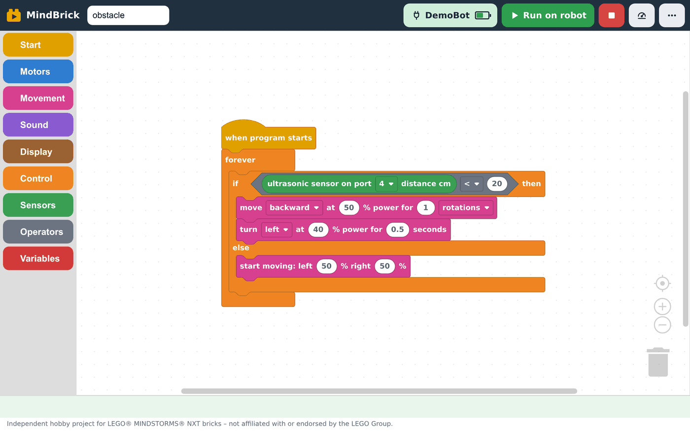

### Tips

- 💾 Your blocks are **saved in the browser automatically**. Close the tab, come back tomorrow, they are still there.
- 📋 Use the **examples** (⋯ → Examples) as starting points, then change numbers and ports to fit your robot.
- 🎯 Not sure what value to compare against? Open the **Robot panel** and watch the live sensor reading while you move your hand or the robot.
- 🖐️ On a tablet, drag with one finger; pinch to zoom; use the bin to delete.

---

## ▶️ Running and stopping

1. Make sure the robot is connected (the `Connect` button shows its name).
2. Press **`▶ Run on robot`**. Watch the status line: *Building your program… → Sending square.rxe to the robot… → ▶ square.rxe is running on the robot.*
3. Press the red **`■`** at any time to stop the program on the brick.

The whole build happens inside the page – the NXC compiler runs as WebAssembly in your browser, so it works without internet after the first visit.

If you press *Run on robot* while **not** connected, the program is still built and checked, and the status line asks you to connect and press again. This is a quick way to check a program for mistakes.

**If something is wrong** with the program, the block that caused it is highlighted and the status line explains the problem in plain words.

---

## 📟 The Robot panel: live sensors and files on the brick

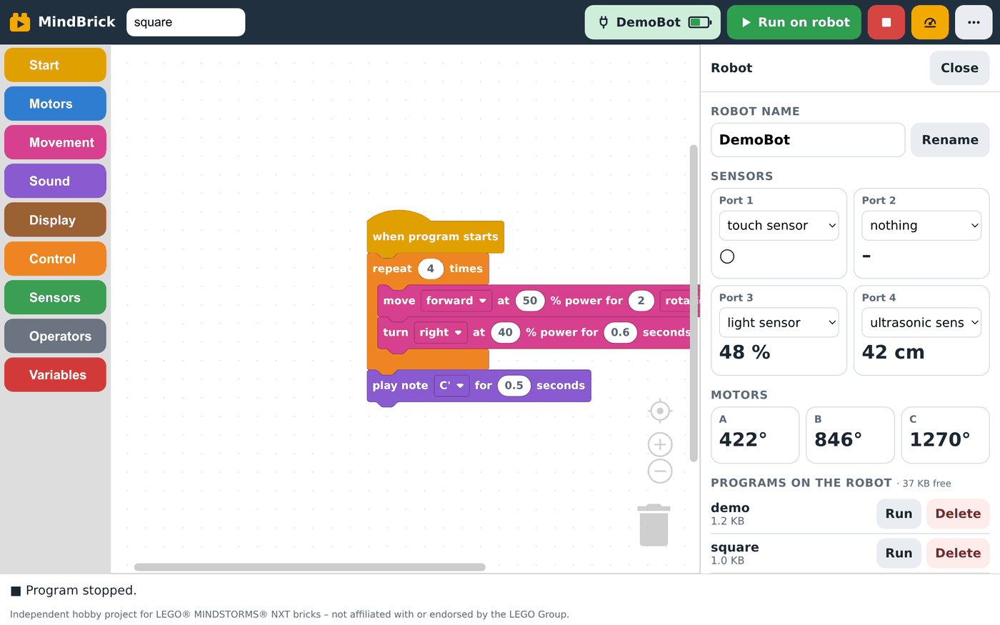

Press the **gauge button** (⏲) in the toolbar to open the Robot panel. It needs a connected robot.

| Section | What you can do |
|---|---|
| **Robot name** | Rename the brick (1 – 15 letters or digits). The new name shows on the brick's screen and in Bluetooth lists. |
| **Sensors** | For each port choose what is plugged in (touch, light, sound, ultrasonic). The **live value** updates while the panel is open: ○ / ● for touch, `%` for light and sound, `cm` for distance. Perfect for finding the right threshold for a line-follower or an obstacle stop. |
| **Motors** | The current rotation angle of motors A, B and C in degrees. Turn a wheel by hand and watch it change. |
| **Programs on the robot** | Every program stored on the brick with its size, plus the **free memory**. `Run` starts a program without re-uploading it; `Delete` removes it to free up space. |

> 💡 The NXT has very little free space (a few dozen KB at best). If uploads fail because the flash is full, delete old programs here – or the stock sound and demo files from the brick's own *My Files* menu.

While a program is running, the panel shows the sensor values as *that program* configured the ports, and a note says so.

---

## ⋯ The ⋯ menu: code, files, examples, language

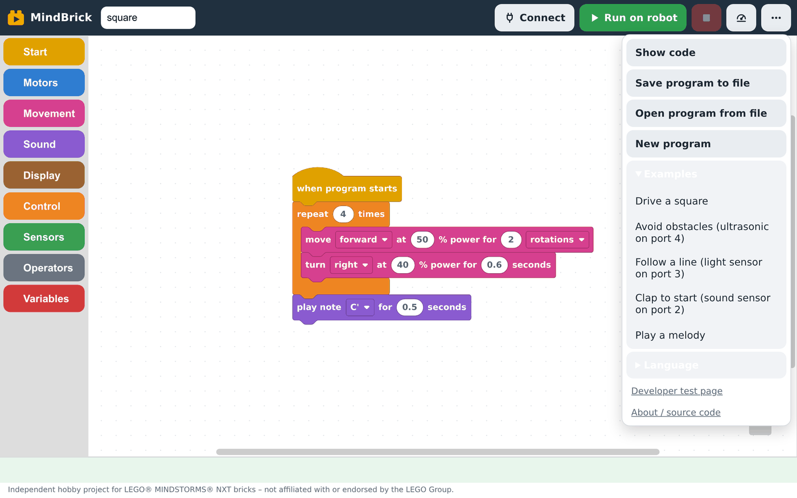

| Entry | What it does |
|---|---|
| **Show code** | Opens a side panel with the **NXC code** made from your blocks. It updates as you edit – a gentle way to see the text version of what you built. |
| **Save program to file** | Downloads a `.mindbrick` file (it is plain JSON). Use it to keep a copy, share it, or move it to another device. |
| **Open program from file** | Loads a `.mindbrick` file. |
| **New program** | Clears the workspace back to the starter program (asks first). |
| **Examples** | Ready-made programs, see below. Opening one replaces your current blocks (asks first). |
| **Language** | English or Deutsch. The browser's language is used the first time; your choice is remembered. |
| **Developer test page** | A bare-bones page with brick info, a file list and a plain NXC text editor. |
| **About / source code** | This repository. |

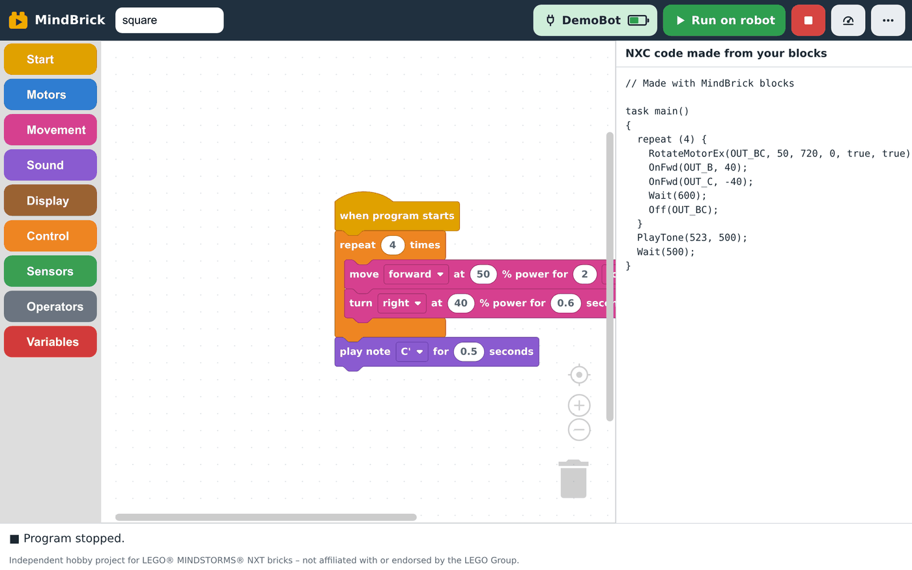

### Examples

| Example | Needs | What it shows |
|---|---|---|
| 🟥 **Drive a square** | motors on B and C | *repeat 4 times*, move for rotations, turn for seconds, play a note at the end |
| 🟩 **Avoid obstacles** | ultrasonic sensor on port 4 | *forever* + *if / else* with a sensor comparison |
| 🟩 **Follow a line** | light sensor on port 3 | reading a sensor in a loop and steering with two motor powers |
| 🟩 **Clap to start** | sound sensor on port 2 | *wait until* a sensor value crosses a threshold |
| 🟪 **Play a melody** | just the brick | a row of *play note* blocks |

### Deutsch

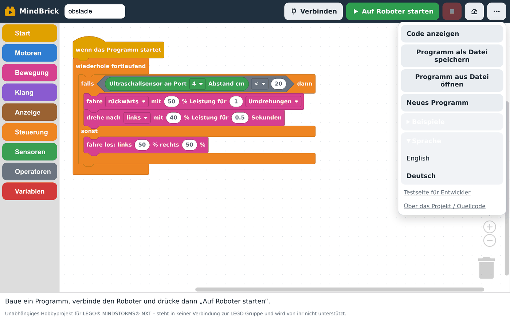

⋯ → *Language* → *Deutsch* switches every text, including the blocks, to German. Your program is kept.

---

## 📱 Using it on a tablet and offline

<div align="center">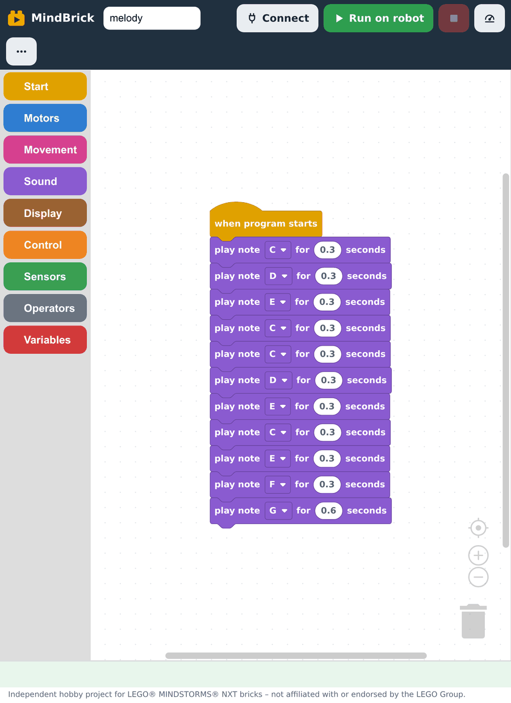</div>

- **Android tablet or phone:** use **Chrome 137 or newer** and connect over **Bluetooth** (pair the brick in Android's Bluetooth settings first, passkey `1234`). USB also works with an OTG adapter.
- **Install it like an app:** browser menu → *Install app* / *Add to home screen*. MindBrick then opens full-screen with its own icon.
- **Works offline:** after the first visit everything – editor, compiler, examples – is stored on the device. The status line says *MindBrick now also works without internet on this device.* When a new version is published you get a note to reload.

---

## 🛠️ Troubleshooting

<details>
<summary><b>"This browser cannot talk to the robot."</b></summary>

Use Chrome or Edge. On Android, Chrome 137 or newer. Firefox and Safari (including every browser on iPhone/iPad) cannot use WebUSB or Web Serial.
</details>

<details>
<summary><b>The brick does not appear in the Bluetooth chooser.</b></summary>

1. Bluetooth must be switched on in the brick's own menu (a key symbol appears at the top of its screen).
2. Pair the brick first in your **device's** Bluetooth settings (not in the browser). Passkey `1234`.
3. Then press `Connect → Bluetooth` in MindBrick and pick the brick from the list. On desktop the list shows serial ports – choose the one with the brick's name.
4. If the brick was paired with another computer before, remove that pairing on the brick (*Bluetooth → Contacts*) and pair again.
</details>

<details>
<summary><b>The brick does not appear in the USB chooser (or "Access denied").</b></summary>

- **Linux:** run `bash tools/install_udev.sh` once, then unplug and replug the cable.
- **Windows:** install the WinUSB driver for the NXT with [Zadig](https://zadig.akeo.ie/) (choose the *LEGO NXT* device, driver *WinUSB*). The original LEGO driver blocks browser access.
- **macOS:** no driver needed. Try another cable or port; some cables are charge-only.
- The brick must be switched on and not in the middle of running a program with the USB cable claimed by other software (close NXT-G, BricxCC or a Python script that is using it).
</details>

<details>
<summary><b>The connection fails right away, or the brick seems busy.</b></summary>

Only one tab or program can hold the brick. Close other MindBrick tabs, the developer test page, or any other software talking to the NXT. Then press `Connect → Disconnect` and connect again. Switching the brick off and on clears a stuck connection.
</details>

<details>
<summary><b>The upload fails or the brick says the memory is full.</b></summary>

The NXT has only a few dozen KB free. Open the Robot panel, look at the free memory next to *Programs on the robot*, and delete programs you no longer need. The stock sound files (`! Startup.rso` etc.) in the brick's *My Files → Sound files* menu take a lot of room and can be deleted too.
</details>

<details>
<summary><b>"Could not reach the last robot."</b></summary>

The *last robot* shortcut tries to reconnect without a chooser. If the brick is off, out of range, or was re-paired, pick it again via `Connect → Bluetooth` or `USB cable`.
</details>

<details>
<summary><b>The robot behaves differently from what I expect.</b></summary>

- Movement blocks assume the drive motors are on **B and C**. Motor blocks let you pick any port.
- Sensor blocks must use the port the sensor is really plugged into. The Robot panel shows live values so you can check.
- Turning by *seconds* depends on battery level and floor; adjust the number.
- The block that caused a build problem is highlighted and the status line explains it.
</details>

<details>
<summary><b>The page looks old after an update.</b></summary>

MindBrick caches itself for offline use. When a new version is published the status line says so – just reload. If in doubt, reload twice.
</details>

---

## 👩‍💻 For developers

The app is plain HTML and JavaScript with **no build step**. Open `web/index.html` from any static server (for example `python3 -m http.server 8765 --directory web`).

| Folder | Contents |
|---|---|
| `web/` | The app: `index.html` + `app.js` (page logic), `blocks.js` (block definitions, toolbox, block texts), `generator.js` (blocks → NXC), `i18n.js` (page texts), `examples.js`, `nbc.js` + `nbc.wasm` (the NBC compiler as WebAssembly, run in a worker), `nxt.js` (NXT protocol over USB / Bluetooth), `mock-brick.js` (the demo robot), `sw.js` (offline support), `test.html` (developer test page), `vendor/` (Blockly and a WASI shim, unmodified) |
| `compiler/` | How `nbc.wasm` is built from the Free Pascal NBC sources, and how it is tested |
| `test/` | Tests for the generator (every generated program is really compiled), the NXT protocol (against a pretend brick), translations and examples |
| `examples/` | NXC example programs |
| `tools/` | Helper scripts: udev rule for Linux, `probe_nxt.py` / `free_flash.py` (Python, need `nxt-python`), `vendor-blockly.mjs`, `make-sw-files.mjs`, `screenshots.mjs` |
| `docs/screenshots/` | The pictures in this README |

```bash
npm install          # development tools only; the app needs no packages at run time
npm test             # generator, protocol, translations, examples
npm run sw           # refresh the offline file list after changing anything in web/
npm run vendor       # update web/vendor/blockly
npm run screenshots  # re-take the README screenshots with headless Chrome (start a server on :8765 first)
```

Add `?demo` to the address to get the **Demo robot** entry in the Connect menu – a pretend NXT that answers every command, handy for trying the app, taking screenshots and automated tests. Add `?lang=de` or `?lang=en` to force a language.

The pipeline is: **Blockly editor → NXC generator → NBC compiler (WebAssembly, in a worker) → `.rxe` → upload over Web Serial (Bluetooth) or WebUSB → start program**. The block editor is kept separate from the execution backend so other backends could be added later.

### Test brick

Read over USB with `tools/probe_nxt.py` on 2026-09-21:

| | |
|---|---|
| Name | `NXT` |
| Firmware | **1.31** (stock LEGO, protocol 1.124) |
| Battery | 7.9 V |
| Free flash | 2504 bytes at first (almost full); about 40 KB after deleting four stock sound files |

---

## ⚖️ Disclaimer and license

MindBrick is an independent hobby project, inspired by modern block-based robot editors. **LEGO® and MINDSTORMS® are trademarks of the LEGO Group, which does not sponsor, authorize or endorse this project.**

Licensed under the **Apache License 2.0**. Bundled third-party parts keep their own licences: the NBC compiler in `web/nbc.wasm` (MPL 1.1, by John Hansen, see `compiler/README.md`), Blockly (Apache 2.0) and browser_wasi_shim (MIT OR Apache 2.0) in `web/vendor/`.
